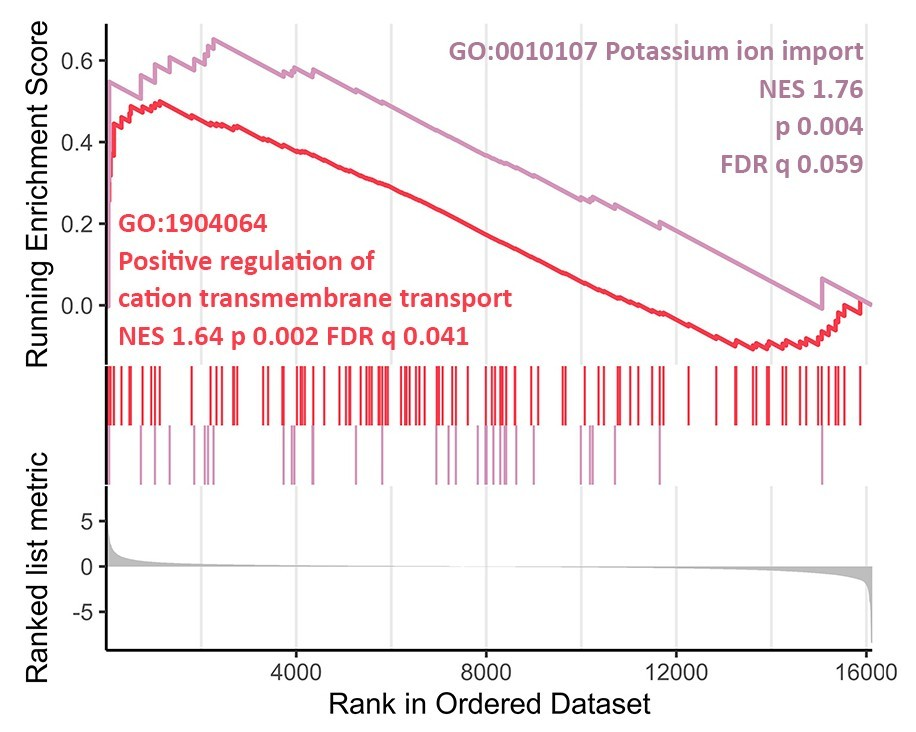

# Uncovering molecular characteristics of cellular senescence process specific to human mesenchymal stem cells

RNA-seq data analysis materials for : 

- *Apoptosis-resistance of senescent cells is an intrinsic barrier for senolysis induced by cardiac glycosides,* Pavel Deryabin, Alla Shatrova, Irina Marakhova, Nikolay Nikolsky, Aleksandra Borodkina, doi: [https://doi.org/10.1101/2020.12.18.423449](https://doi.org/10.1101/2020.12.18.423449)
- Bioinformatics institute fall 2020 research project

# Goal and objectives

## Goal

Identify specific molecular characteristics of human mesenchymal stem cells senescence underlying their resistance to cardiac glycosides (CGs) mediated senolysis based on the RNA-seq data

## Objectives

- Find and load GEO expression datasets relevant for the analysis 
[SRAtoolkit](https://github.com/ncbi/sra-tools) (2.10.9)
- Evaluate and correct raw sequencing data quality 
[FastQC](https://github.com/s-andrews/FastQC) (0.11.7), [FastqPuri](https://github.com/jengelmann/FastqPuri) (1.0.7), [BBTools](https://jgi.doe.gov/data-and-tools/bbtools/) (38.75)
- Estimate transcripts abundances and load them into R environment
[salmon](https://github.com/COMBINE-lab/salmon) in the [Selective Alignment mode](https://combine-lab.github.io/alevin-tutorial/2019/selective-alignment/) (1.1.0) / [tximeta](https://bioconductor.org/packages/release/bioc/html/tximeta.html) (1.4.5)
- Perform differential gene expression testing
[DESeq2](http://bioconductor.org/packages/release/bioc/html/DESeq2.html) (1.26.0), [apeglm](https://bioconductor.org/packages/release/bioc/html/apeglm.html) (1.8.0)
- Explore functional characteristics and visualize identified transcriptional signatures
[clusterProfiler](https://bioconductor.org/packages/release/bioc/html/clusterProfiler.html) (3.14.3), [fgsea](https://bioconductor.org/packages/release/bioc/html/fgsea.html) (1.12.0), [genefilter](https://bioconductor.org/packages/release/bioc/html/genefilter.html) (1.38.0), [pheatmap](https://cran.r-project.org/web/packages/pheatmap/index.html) (1.0.12)

## Study design and data

To determine possible transcriptomic features mediating cell type dependent CGs-resistance or -sensitivity of senescent cells we asked the question: how senescence of CGs-resistant cells (in particular, END-MSCs) *differs* from senescence of CGs-sensitive cells (A549 and IMR-90)? To answer this question, we utilized three independent RNA sequencing datasets relevant for for ouabain CG application: 

- [GSE160702](https://www.ncbi.nlm.nih.gov/geo/query/acc.cgi?acc=GSE160702) Young and senescent END-MSCs performed by us
- [GSE102639](https://www.ncbi.nlm.nih.gov/geo/query/acc.cgi?acc=GSE102639) Young and senescent A549 from [*Wang L. et al., Cell reports, 2017*](https://www.cell.com/cell-reports/fulltext/S2211-1247(17)31390-6?_returnURL=https%3A%2F%2Flinkinghub.elsevier.com%2Fretrieve%2Fpii%2FS2211124717313906%3Fshowall%3Dtrue). Here, senescence inducing conditions coincided with those applied in our experiments and in the pilot studies of CGs-induced senolysis (*[Triana-Martínez F. et al., Nat Commun, 2019](https://www.nature.com/articles/s41467-019-12888-x)*; *[Guerrero A. et al., Nat Metab, 2019](https://www.nature.com/articles/s42255-019-0122-z)*)
- [GSE122081](https://www.ncbi.nlm.nih.gov/geo/query/acc.cgi?acc=GSE122081) Young and senescent IMR-90 directly from the pilot study on CGs as senolytic compounds

## Materials

- **data/** folder with ****general scripts for GEO data downloading and preraration
- **qc/** folder with QC reports for raw and processed reads data, scripts for reads filtering and trimming
- **salmon/** folder with salmon transcripts quantification statistics and the corresponding scripts, coldata.csv
- main **Rscript.R** with ****delailed description of the further analysis
- **results/** folder with key output results (DE testing output, GSEA results, visualization)

Raw (reads data) and processed (salmon quants output, primary and filtered DESeqDataSet objects, DESeqResults objects with metadata from tximeta) data generated in the study are deposited at the [GSE160702](https://www.ncbi.nlm.nih.gov/geo/query/acc.cgi?acc=GSE160702) (GSE160702_quants.tar.gz, GSE160702_ouabain_senolysis_article.RData.gz)

## Key results

Differential testing for the last variable in the model presented at the scheme above (P1 : P2) and further conducting gene set enrichment analysis (GSEA) in Gene Ontology (GO) terms for Biological Processes (BP) let us to functionally characterize differentially expressed genes during senescence of CGs-resistant and -sensitive cells

Among the significantly enriched processes we found ‘Potassium ion import’ and ‘Positive regulation of cation transmembrane transport’ to be up-regulated during senescence of CGs-resistant END-MSCs compared to senescence of CGs-sensitive cells. 

Moreover, END-MSCs acquire apoptosis-resistant phenotype during senescence, while sensitive to CGs-mediated senescent IMR-90 and A549 became apoptosis-prone

## Conclusions

- The absence of senolytic effect of CGs on hMSC might be mediated by effective K+ cellular import supporting ionic balance and increased apoptosis resistance
- Apoptosis resistance is not a general feature of senescent cells, as during senescence some cells acquire ‘apoptosis-resistant’ phenotype, while others do not. Hence, probably, effectiveness of other senolytic approaches might depend on whether senescent cells are indeed apoptosis-resistant compared to their proliferating counterparts